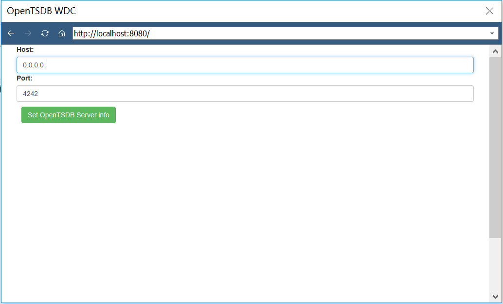
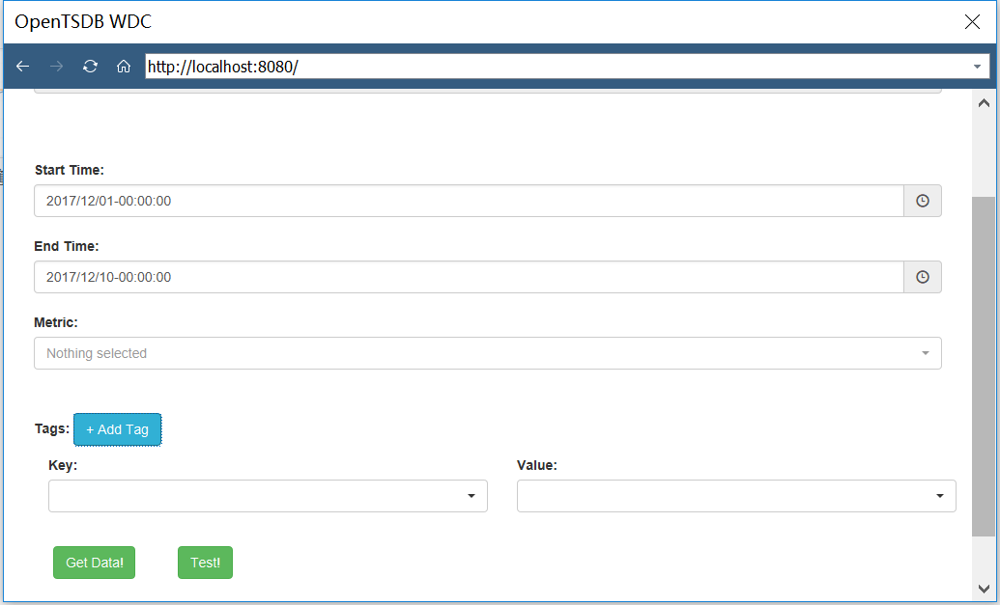
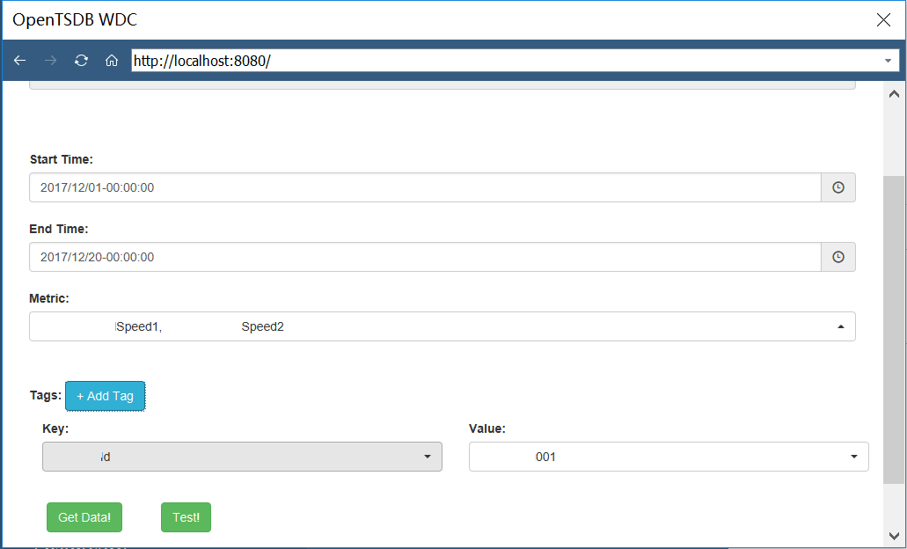
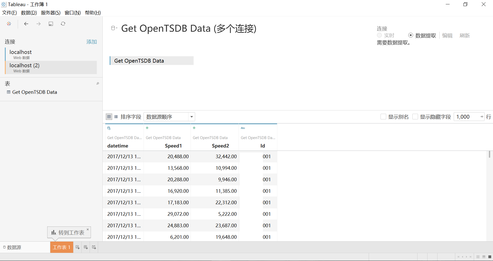
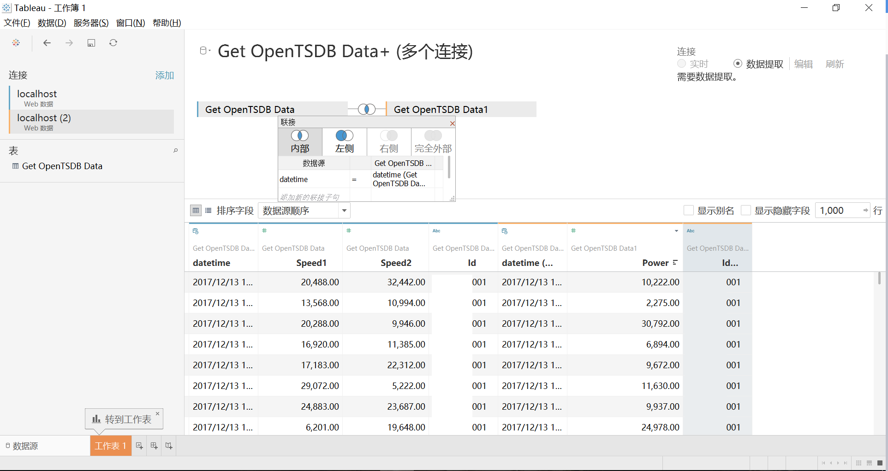
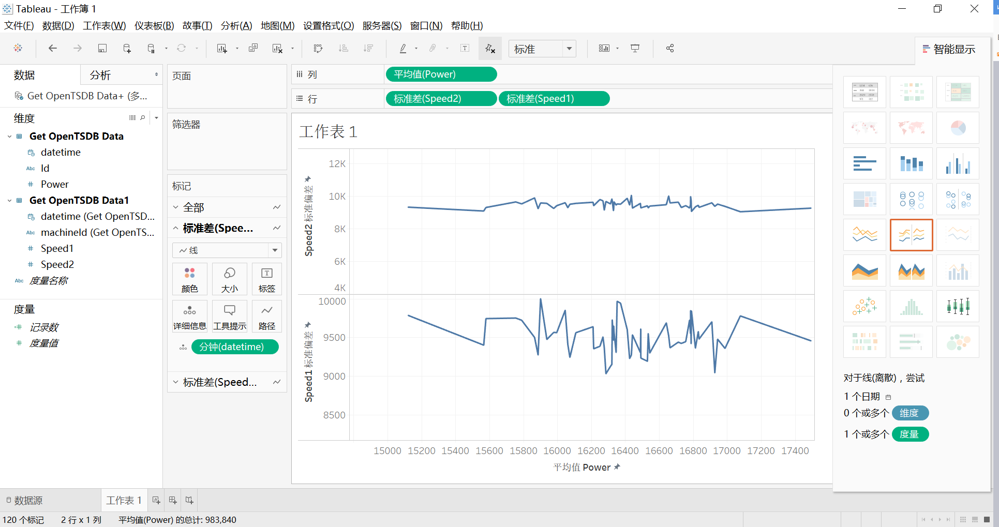

# OpenTSDB Web Data Connector for Tableau

## Introduce

OpenTSDB Web Data Connector for Tableau in java.

For more information of Tableau Web Data Connector refer to:
 1. http://tableau.github.io/webdataconnector/docs/
 2. https://github.com/tableau/webdataconnector.git
 3. https://connectors.tableau.com/libs/tableauwdc-2.2.latest.js

## Develop

### properties

- application.properties
   - configuration for application

## Get Start

### run application

 1. `yum install maven git`
 2. `git clone https://github.com/SkyAI/OpenTSDBTableauConnector`
 3. `vim OpenTSDBTableauConnector/src/main/resources/application.properties`, Update configutation of application
 4. Simply run the following command from the project root directory: `mvn install`
 5. `cd target`
 6. run the application `java -jar ****.jar`

### open front page

 1. Open Tableau, choose "Web Data Connector"

 2. Enter url : http://`{host}`:`{port}`, default port is 8080

 

 3. Enter host and port of OpenTSDB in the input box. Click "Set OpenTSDB Server Info".

 

 4. select data ranges to loads.

 

 5. Click `Get Data`. Then Tableau can pull data from OpenTSDB.

 

 6. Use multi-table joins to load large amounts of timing data.

 

 7. Draw your diagram.

 
